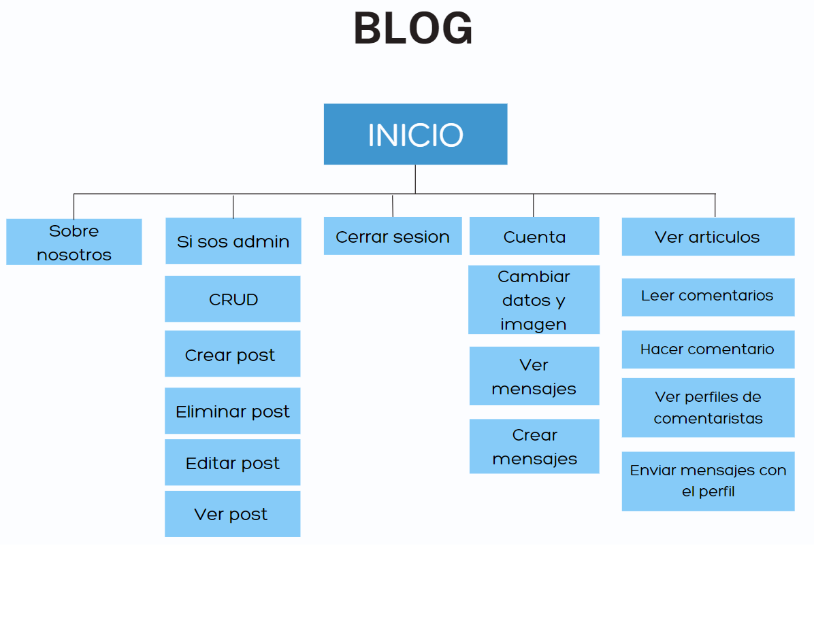

# Proyecto de BLOG para Coderhouse

Equipo de trabajo:

* Matias Mancini
[@EMME-ESSE](https://github.com/EMME-ESSE)
* Matias Poses 
[@campeone-pixel](https://github.com/campeone-pixel)

### Contenido
> Se muestran las secciones del contenido

- [Descripcion](#descripcion)
- [División de trabajos](#división-de-trabajos)
- [Video del blog](#Video-del-blog)
- [Estructura del proyecto](#Estructura-del-proyecto)
- [Mapa del sitio](#Mapa-del-sitio)
- [Dependencias](#dependencias-necesarias)

## Descripción

BLOG realizado para el curso de Python de Coderhouse. 
En este BLOG se pueden leer noticias actuales, comentar los diferentes articulos y enviar mensajes entre los usuarios. Solo los superusuarios pueden agregar, editar y borrar los posts.

[Back to the top](#proyecto-de-blog-para-coderhouse)

## División de trabajos

Matias Poses: Estructura principal del proyecto junto al debugging del mismo y Estilizacion de  las paginas con su correspondiente html.

Matias Mancini: Programación de las paginas, y documentacion del proyecto.

[Back to the top](#proyecto-de-blog-para-coderhouse)

## Video del BLOG

[Back to the top](#proyecto-de-blog-para-coderhouse)
## Estructura del projecto
[Back to the top](#proyecto-de-blog-para-coderhouse)

## Mapa del Sitio

En la pagina principal se muestran los enlaces a las demas junto con un cambio en las opciones que dependen del si esta logueado el usuario o no.
Las posibles paginas accesibles son la del chat entre usuarios para el cual se precisa estar registrado y logueado, un registro e inicio de sesion y una pagina dedicada a los desarrolladores para conocer sobre ellos.

Mapa del sitio si no se inicia sesion:

Mapa del sitio si se inicia sesion:

[Back to the top](#proyecto-de-blog-para-coderhouse)

## Dependencias necesarias
* asgiref==3.5.2
* Django==4.1.1
* django-appconf==1.0.5
* django-ckeditor==6.5.1
* django-crispy-forms==1.14.0
* django-debug-toolbar==3.6.0
* django-imagekit==4.1.0
* django-js-asset==2.0.0
* django-widget-tweaks==1.4.12
* mypy-extensions==0.4.3
* pathspec==0.10.1
* pilkit==2.0
* Pillow==9.2.0
* platformdirs==2.5.2
* six==1.16.0
* sqlparse==0.4.2
* tomli==2.0.1
* tzdata==2022.2

[Back to the top](#proyecto-de-blog-para-coderhouse)
##  
