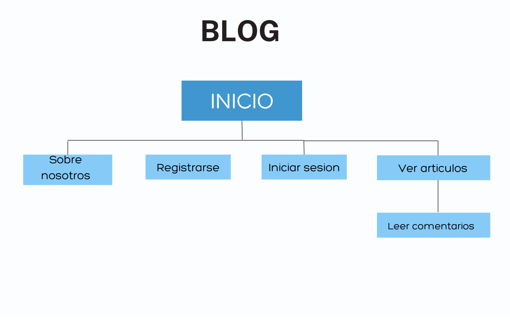

# Proyecto de BLOG para Coderhouse

Equipo de trabajo:

* Matias Mancini
[@EMME-ESSE](https://github.com/EMME-ESSE)
* Matias Poses 
[@campeone-pixel](https://github.com/campeone-pixel)


### Contenido
> Se muestran las secciones del contenido

- [Descripcion](#descripcion)
- [División de trabajos](#división-de-trabajos)
- [Video del blog](#Video-del-blog)
- [Estructura del proyecto](#Estructura-del-proyecto)
- [Mapa del sitio](#Mapa-del-sitio)
- [Dependencias](#dependencias-necesarias)


## Descripción

BLOG realizado para el curso de Python de Coderhouse. 
En este BLOG se pueden leer noticias actuales, comentar los diferentes articulos y enviar mensajes entre los usuarios. Solo los superusuarios pueden agregar, editar y borrar los posts.

[Back to the top](#proyecto-de-blog-para-coderhouse)

## División de trabajos

Matias Poses: Estructura de la pagina de inicio, el CRUD y Estilizacion de  las paginas con su correspondiente html.

Matias Mancini: Estructura del registro de usuario como tambien la autenticacion, los cambios de datos de perfil y mensajerias.

[Back to the top](#proyecto-de-blog-para-coderhouse)

## Video del BLOG

https://www.youtube.com/watch?v=IzJz04zUtfU&ab_channel=matiasmancini

[Back to the top](#proyecto-de-blog-para-coderhouse)
## Estructura del proyecto

* Carpeta blog del proyecto<br>
  Contiene las views para renderizar el inicio con todos sus posts

* Static Folder<br>
  Se creo usando el comando collectstatic

* Carpeta media<br>
  En esta carpeta se suben todos las imagenes de post como tambien las imagenes de perfil de cada usuario.

* Carpeta template <br>
  Se crearon templates bases y se creo una carpeta include donde se separo los contenidos de cada pagina separandolo en sidebar, secciones principales, navbar, footer

  El proyecto se dividio en tres app diferentes. Estas son:
* Mensajes
  - Modelo Mensajes
  - Las views para crear, ver mensajes
  - Formularios para crear mensajes

* Users

  - Modelo Perfil
  - Views para iniciar sesion, registrarse, cerrar sesion y editar perfil


* Blogapp
  - Modelos categorias, tag, escritor, post y comentarios
  - Views agregar post, actualizar post, ver post, buscar post
  - Formularios comentarios y post


[Back to the top](#proyecto-de-blog-para-coderhouse)

## Mapa del Sitio

En la pagina principal se muestran los enlaces a las demas junto con un cambio en las opciones que dependen del si esta logueado el usuario o no.
Las posibles paginas accesibles son la de la mensajeria entre usuarios para el cual se precisa estar registrado y logueado, un registro e inicio de sesion y una pagina dedicada a los desarrolladores para conocer sobre ellos.

Mapa del sitio si no se inicia sesion:

Mapa del sitio si se inicia sesion:


[Back to the top](#proyecto-de-blog-para-coderhouse)

## Dependencias necesarias

````
pip install -r requirements.txt 
````

[Back to the top](#proyecto-de-blog-para-coderhouse)
##  
